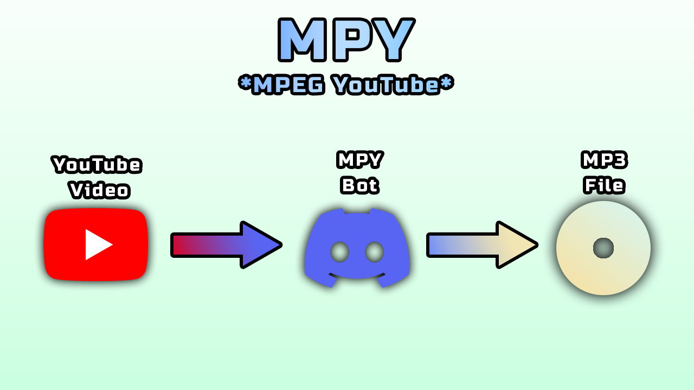

# [YouTube-Discord-Fetch-](https://www.youtube.com/watch?v=VeFbgIE6OHo)
Project for CNT 4104 (Software Proj Comp Networks)
We will be creating a Discord bot that takes YouTube song titles and or URL and converts them to YouTube links and mp3 files. Using the basic YouTube search format, “https://www.youtube.com/results?search_query=search_terms”, we will be able to search YouTube using the song title entered by the user. This Discord bot will be used for streaming purposes and file conversion. What can also be added is the different formats that a bot can be linked to as Discord has different methods in which bots execute messages, ranging from embedded to icons that can be interacted with. 

The main language we will be initially implementing is Python. We will be using youtube_dl to import Youtube webm.  

# How was the Bot Created:
1. follow these guides to begin:

    - [Create your bot](https://discordjs.guide/preparations/setting-up-a-bot-application.html#creating-your-bot)

    - [add your bot to a server](https://discordjs.guide/preparations/adding-your-bot-to-servers.html)

2. install [ffmpeg](https://www.gyan.dev/ffmpeg/builds/)

    - extract **ffmpeg-git-full.7z**

   - copy the bin folder to C:\ 
   - rename **bin** to **ffmpeg**

alternatively, add ffmpeg to PATH variables

3. install **requirements.txt** `pip install -r requirements.txt`

4. run the bot using `py main.py 'example_token'`

# How to add our Youtube Bot to any Server: 
This discord bot can be manually added to any Server that the user requests. 

 
